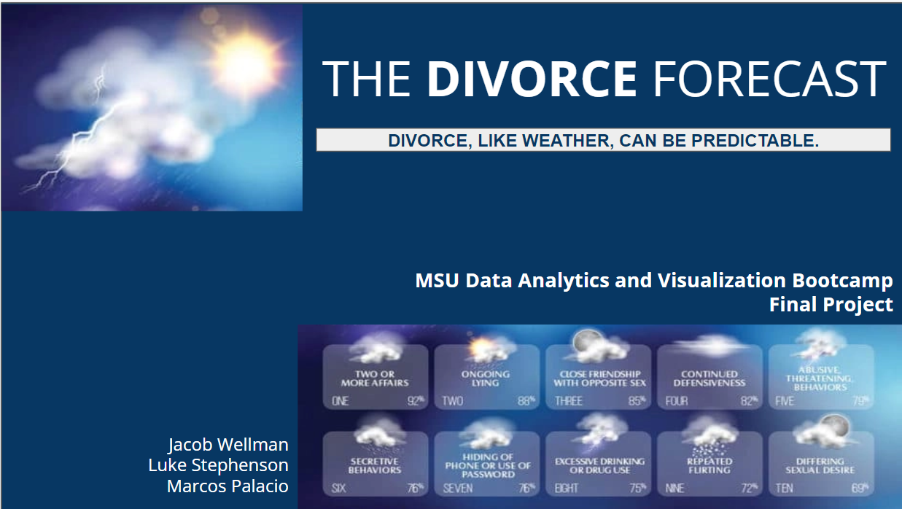

# Final Project - Divorce Analysis

## Selected topic 
 In this project we are examining a potential relationship between divorce and weather patterns at a county level.
 
## Reason why they selected their topic 
 This project is a confluence of our shared interests, we wanted to examine how external forces influence personal relationships.
 
## Description of their source of data 
### Bowling Green State University County-Level Marriage and Divorce Data
 This data catalogs the divorces and marriages for every US county in 2010. 
 It has 3143 rows and 5 columns: co_fips(county code), county, state, divorces 2010, and marriage 2010.   
- [Link to Bowling Green State University County-Level Marriage and Divorce Data](https://www.bgsu.edu/ncfmr/resources/data/original-data/county-level-marriage-divorce-data-2010.html)

### 2000 County Level Divorce Data Spreadsheet
These maps present geographic variation in the adjusted marriage and divorce rates for over 3,000 counties in the United States. The estimates are from county court record data of numbers of marriages and divorces and U.S. Census data from 2000
- [Link to Bowling Green State University 2000 County Level Divorce Data Spreadsheet](https://www.bgsu.edu/ncfmr/resources/data/original-data/county-level-marriage-divorce-data-2000.html)

### US Census Data for 2010-2019
 Every decade the US Census Bureau produces a report of the current population of the United States.
 In between these decennial censuses the bureau models demographic trends for the country.
 This data shows the count for the 2010 census and the agencies subsequent population estimates over the 2010's.  
- [Link to US Census Data for 2010-2019](https://www.census.gov/data/datasets/time-series/demo/popest/2010s-counties-total.html)

### National Centers for Environmental Information 
 The NCEI Data Access application offers a wide variety of download and subsetting options for a growing collection of weather data, including precipitation and temperature     information 
 The Rankings are compiled using county-level measures from a variety of national and state data sources using a code to deploy an API.
 This data shows the more than 15000 weather data by county for specific months of the year to collect most crititcal values within states.  
- [National Centers for Environmental Information](https://www.ncei.noaa.gov/access)

### National County Health Rankings 2010-2019
 The County Health Rankings is a program of the University of Wisconsin Population Health Institute that measures the health of nearly all counties 
 The Rankings are compiled using county-level measures from a variety of national and state data sources.
 This data shows the more than 144 key health factors by county in US and ranks them within states.  
- [National County Health Rankings 2010](https://www.countyhealthrankings.org/explore-health-rankings/rankings-data-documentation/national-data-documentation-2010-2019)

## Questions they hope to answer with
 We want to predict if there is a relationship between the success of a marriage based on its local climate.
 We hope to create a model that can predict future divorce rates of counties 
 
##  Description of the communication protocols 
 Throughout this project the group has constantly made contact through the slack app.
 This includes sharing information that we find online, code & arranging meetings at least once a week.
 TO_DO List Tracker has been developed to monitor progress of deliverables 
 - [TO_DO List Tracker](https://docs.google.com/spreadsheets/d/1U_9O-k0YK3AiKl6bOaacjRLvW4Q3csCAwT0udpdqPrk/edit?usp=sharing)

## Tools
Creating Database
- PostgreSQL
Connecting to Database
- Psycopg2
Analyzing Data
-Pandas
Machine Learning
- Visual Studio 
Dashboard
Flask
HTML
CSS
Heroku

## Data Cleaning Steps
Here, our dataset had to be separated, sorted and transformed further before performing any analysis
- Import the csv file was into a Pandas DataFrame
- Fill zero value into null data from dataset
- Manipulate data for Bedford City due to legal status change
- Change county names to split out state and create new column with 2-letter code (+3,200)
- Join the dataframes on 'Geographic Area' to merge the datasets (Census & Divorce)
- Development of API to obtain Weather Data by county  (+16,200)

- [Census and Divorce Dataset Cleaning here](static/Jupyter_Notebooks/Data_Cleaning_Divorce_Weather.ipynb)
- [Wethaer API Data Code here](static/Jupyter_Notebooks/Get_Weather_Data_2.ipynb)

## Database 
Our database contains a 4 main tables (county_prep, county_temp, divorce_200, divorce_2010) which captures the dataset for 2000 and 2010 related with weather precipitacion (days with > 0.1 inch of precipitation, extreme maximum precipitation,  days with snow >0.1 inch of snow) and and temperature (days over 90 and days under 32) by county. USe of a DB allows for the following benefits: 

- Quick retrieval of data
- Mitigating redundant data in child tables
- Preserving data integrity by having the features of each person stored once

## Machine Learning 
Neural Network Machine Learning Algorithms to predict if there is a relationship between divorce and weather patterns at a county level. 
Steps include our Keras model, using the fit method and provide the x training values and y training values, as well as the number of epochs.
-Input Values = Weather by Years 
-Output = Divorce Rate 

- [Correlation Matrix here](static/Jupyter_Notebooks/DivorceNN.ipynb)

## Correlation Matrix
In reviewing the various factors from weather and census data, we decided it would be useful to look at a correlation matrix. We quickly realized a majority of the factors do not have a correlation at all with the overall total scores. The following correlation matrix shows the weather, census and divorce rate relation.

- [Machine Learning here](static/Jupyter_Notebooks/correlation_matrix.ipynb)

## Dashboard
The dashboard is an interactive webpage using machine learning to predict divorce rate. Dashboard is available [here](https://some-dont-like-it-hot.herokuapp.com/)

## Conclusion / Next Steps

- There is statistical evidence that there is not relation between weather factors (rain and temperature) and divorece rate. Based on census and divorce data for 3,242 Counties during 2000 and 2010 

-Machine Learning → After  trained neural network model and verified its performance using a test dataset, it could be applied novel datasets using health data to predict divorce rates based on additional inputs in the model.

## Google Slide Presentation Link
- [Divorce, like Weather, can be predictable here](https://docs.google.com/presentation/d/1D8cOtKXKZau2pQhyuw1ub7cr5JZfprV3wk8EgnLWJCA/edit?usp=sharing)
 

